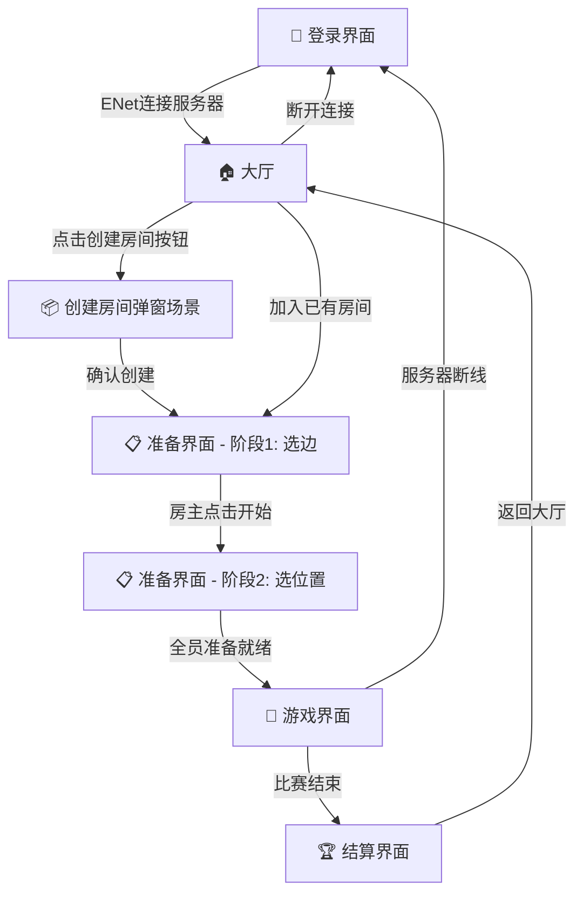

# 🥌 whgame_Curling — 核心设计文档

> **本文档是项目的唯一权威蓝图。所有开发工作必须以本文档为准。**
> 在双方对文档达成一致之前，不编写任何代码。

---

## 目录

1. [核心原则](#1-核心原则)
2. [冰壶规则映射](#2-冰壶规则映射)
3. [网络架构方案](#3-网络架构方案)
4. [UI 流程与界面设计](#4-ui-流程与界面设计)
5. [场景树架构与预制体拆分](#5-场景树架构与预制体拆分)
6. [物理模拟设计](#6-物理模拟设计)
7. [输入系统](#7-输入系统)
8. [音效与视觉效果](#8-音效与视觉效果)
9. [目录结构](#9-目录结构)
10. [开放问题 / 待讨论](#10-开放问题--待讨论)

---

## 1. 核心原则

### 1.1 场景驱动，代码辅助

- **尽可能使用 `.tscn` 预制体**，即使是动态性很强的元素（如冰壶、擦冰特效），也要先创建为静态场景，再由代码实例化。
- **禁止在代码中拼装节点树**。所有节点结构必须在场景编辑器中预先定义。
- 使用 `@export` 暴露所有可调参数（物理系数、速度、UI 文本等），让引擎原生检查器成为主要配置界面。

### 1.2 适当解耦

- 每个独立概念对应一个独立场景（冰壶、赛道、HUD、大本营等）。
- 弹窗、对话框等 UI 也作为独立场景，运行时实例化叠加。
- 场景之间通过 **信号（Signal）** 和 **组（Group）** 通信，降低耦合度。
- 网络层与游戏逻辑层分离：游戏逻辑不应直接调用网络 API，而是通过抽象接口。

### 1.3 MCP 优先

- 在工作流中尽可能使用 MCP 工具（`mcp_godot_*`）来创建场景、添加节点、设置属性。
- 手动编辑 `.tscn` 文件仅在 MCP 无法完成的场合使用。

### 1.4 技术栈

| 项目       | 选型                           |
| ---------- | ------------------------------ |
| 引擎       | Godot 4.6.1 Mono (GDScript)   |
| 维度       | **2D（俯视角）**              |
| 物理       | Godot 内置 2D 物理引擎        |
| 渲染       | Forward+ / D3D12              |
| 目标平台   | Windows（客户端）              |
| 语言       | GDScript（不使用 C#）         |
| 网络       | ENet（公网专用服务器模式）     |
| 服务器     | Godot Headless（无头模式）     |

> **2D 而非 3D**：冰壶运动本质上是一个 2D 平面上的物理问题（俯视角），使用 2D 更简洁高效。冰壶使用图片素材表示。

---

## 2. 冰壶规则映射

### 2.1 基本赛制

| 规则项       | 真实规则                           | 游戏实现                             |
| ------------ | ---------------------------------- | ------------------------------------ |
| 局数         | 标准 10 局，加时赛                 | 默认 8 局（可配置 4/6/8/10），平局加时 |
| 每队人数     | 4 人                               | 每队 1~4 人（最少 1 人即可开赛）     |
| 每局壶数     | 每队 8 壶（每人 2 壶）            | 每队 8 壶                            |
| 投壶顺序     | 一垒→二垒→三垒→四垒，双方交替    | 相同                                 |
| 先后手       | 赛前决定，得分方下一局失去后手     | 相同                                 |

### 2.2 队伍角色

每队有 **4 个位置**（一垒、二垒、三垒、四垒），每个位置每局投掷 2 壶。

每个位置有 **2 个角色**：

| 角色       | 职责说明                                       |
| ---------- | ---------------------------------------------- |
| **投壶手** | 控制冰壶的投掷方向、力度和旋转                 |
| **擦冰员** | 控制冰壶滑行过程中的擦冰时机和位置，影响摩擦力 |

> 不设"指挥"角色——这是游戏，所有人都能看到赛道全局，不需要额外指挥。

### 2.3 最低人数要求

- 每队 4 个位置 × 2 个角色 = **每队 8 个槽位**。
- **所有槽位必须有人担任**，不存在空置和 AI 补位。
- 一个玩家可以认领多个槽位。
- 最少情况：每队 1 人，该人认领本队全部 8 个槽位。
- 两队合计最少 **2 人**即可开赛。

### 2.4 投壶阶段流程

```
投壶手准备 → 设定方向/力度/旋转 → 释放冰壶 →
擦冰员介入（在冰壶滑行过程中擦冰控制方向和距离） →
冰壶最终停止 → 判定是否出界 → 下一壶
```

### 2.5 得分规则

- 仅**位于大本营内**（或接触大本营边缘）的冰壶参与得分判定。
- 距离圆心**最近**的冰壶所属队伍为本局得分方。
- 该队所有**比对手最近壶更接近圆心**的冰壶数量 = 本局得分。
- 大本营内无壶 → 双方 0 分，后手权不变。

### 2.6 自由防守区规则（Free Guard Zone）

- 每局前 5 壶（双方合计）内，**不得击打移除**对方位于自由防守区（前卫线与大本营之间）的冰壶。
- 如果违规击出 → 被击出的冰壶恢复原位，违规壶移除出场。

### 2.7 擦冰机制

| 属性     | 说明                                     |
| -------- | ---------------------------------------- |
| 擦冰区域 | 前卫线（Hog Line）到 T 线之间           |
| 效果     | 减少摩擦 → 冰壶走得更远、弧线更直       |
| 操作     | 擦冰员在冰壶经过的区域点击/按住进行擦冰 |

---

## 3. 网络架构方案

### 3.1 公网 ENet 专用服务器模式

所有玩家通过 ENet 连接到部署在**公网**的专用服务器。所有数据（大厅、房间、游戏）全部经过服务器转发。

**为什么不用 P2P？**
- 玩家都在 NAT 后面，P2P 需要复杂的 NAT 穿透，且不保证成功。
- 冰壶是回合制游戏，数据量极小（每秒几个包），服务器转发完全没有性能压力。
- 集中式服务器架构最简单、最可靠、零 NAT 问题。

### 3.2 架构图

```
                ┌──────────────────────────────────┐
                │     公网 ENet 专用服务器          │
                │                                  │
                │  功能:                           │
                │  · 用户登录（记录用户名）         │
                │  · 大厅管理（房间列表、在线人数） │
                │  · 房间管理（创建/加入/离开）     │
                │  · 准备阶段同步（选边、选位置）   │
                │  · 游戏物理模拟（服务器权威）     │
                │  · 转发游戏数据给所有客户端       │
                │                                  │
                └──────┬───────┬───────┬───────────┘
                       │ ENet  │ ENet  │ ENet
                       │       │       │
                ┌──────┴──┐ ┌──┴─────┐ ┌┴────────┐
                │ 玩家 A  │ │ 玩家 B │ │ 玩家 C  │
                │(NAT后)  │ │(NAT后) │ │(NAT后)  │
                └─────────┘ └────────┘ └─────────┘

            所有数据都经过服务器，无 P2P，无 NAT 问题
```

> **关键优势：** 玩家只需输入服务器地址和端口即可连接，无论在哪个网络环境下都能正常使用。

### 3.3 服务器职责

| 阶段     | 服务器职责                                       |
| -------- | ------------------------------------------------ |
| 登录     | 记录用户名和 peer_id，发送当前大厅状态           |
| 大厅     | 管理房间列表，广播房间变动                       |
| 准备阶段 | 同步选边/选位置状态给房间内所有人               |
| 游戏中   | **运行物理模拟**，广播冰壶位置，判定得分         |
| 结算     | 广播最终成绩，清理房间或等待下一局               |

### 3.4 连接流程

```
═══════════ 阶段 1：登录 ═══════════════════════════════════

玩家启动游戏 → 输入用户名 + 服务器地址 + 端口
→ 通过 ENet 连接到公网服务器
→ 服务器记录该用户，发送房间列表
→ 进入大厅

═══════════ 阶段 2：大厅 & 房间 ═════════════════════════════

· 大厅显示房间列表（服务器维护并广播）
· 创建房间 → 服务器创建房间记录，创建者成为房主
· 加入房间 → 服务器将玩家加入房间
· 选边、选位置 → 服务器同步状态给房间内所有人

═══════════ 阶段 3：游戏进行中 ═══════════════════════════════

· 投壶参数（方向、力度、旋转）→ 客户端发送给服务器
· 服务器运行物理模拟 → 广播冰壶位置给所有客户端
· 擦冰操作 → 客户端实时发送给服务器，影响物理模拟
· 壶全部停止 → 服务器计算得分并广播

═══════════ 阶段 4：结算 ═════════════════════════════════════

· 服务器广播最终成绩
· 玩家返回大厅（仍保持 ENet 连接）
```

### 3.5 网络同步策略

```
客户端 A（投壶手）  ──投壶参数──▶  服务器
                                    │
                               物理模拟
                                    │
服务器  ──同步壶位置──▶  所有客户端
```

- **投壶参数**（方向、力度、旋转）由操作的客户端发送给服务器。
- **物理模拟**仅在服务器端运行，客户端只做视觉插值。
- **擦冰操作**实时传输到服务器端以影响物理模拟。
- 壶全部停止后，服务器广播最终位置和得分。
- 服务器拥有**完全权威**，客户端无法作弊。

### 3.6 服务器实现方案：Godot Headless

使用 **Godot Headless** 运行服务器端：
- 与客户端共享同一套 GDScript 代码（物理、规则逻辑等）。
- 通过启动参数区分客户端/服务器模式（如 `--server`）。
- 服务器端不渲染画面，只运行逻辑和物理。
- 部署：将 Godot 项目导出为 headless 版本，放在公网服务器上运行。

**启动方式：**
```bash
# 客户端启动（正常方式，双击 exe 或）
./whgame_Curling.exe

# 服务器启动（headless 模式，在公网服务器上运行）
./whgame_Curling.exe --headless -- --server --port 7777
```

**代码中的模式区分：**
```gdscript
# autoload/game_manager.gd
func _ready():
    var args = OS.get_cmdline_user_args()
    if "--server" in args:
        _start_server_mode()
    else:
        _start_client_mode()
```

**服务器部署要求：**
- 公网 Linux/Windows 服务器
- 开放 ENet 端口（默认 7777/UDP）
- 具体部署步骤将在 `README.md` 中详细说明

---

## 4. UI 流程与界面设计

### 4.1 界面流转图



### 4.2 登录界面

```
┌─────────────────────────────────────┐
│          whgame_Curling             │
│                                     │
│   用户名:  [________________]       │
│                                     │
│   服务器:  [play.curling.com]       │
│   端口:    [7777]                   │
│                                     │
│           [ 连 接 ]                 │
│                                     │
│   状态: 等待连接...                 │
└─────────────────────────────────────┘
```

**功能要点：**
- 输入用户名（纯显示用，不做身份验证）。
- 输入服务器地址和 ENet 端口。
- 点击连接 → 通过 ENet 连接到公网服务器。
- 连接成功后自动进入大厅。
- 全程使用同一条 ENet 连接（大厅、准备、游戏都走同一连接）。

### 4.3 大厅界面

```
┌─────────────────────────────────────────────┐
│  大厅            在线: 5 人     [断开连接]  │
├─────────────────────────────────────────────┤
│                                             │
│  房间列表:                                  │
│  ┌──────────────────────────────────────┐   │
│  │ 房间名       人数   状态    操作     │   │
│  │ "友谊赛"     3/8   等待中  [加入]   │   │
│  │ "练习场"     1/8   等待中  [加入]   │   │
│  └──────────────────────────────────────┘   │
│                                             │
│  [创建房间]  ← 点击后弹出独立场景           │
│                                             │
└─────────────────────────────────────────────┘
```

**创建房间弹窗（独立场景 `create_room_dialog.tscn`）：**

```
┌─ 创建房间 ──────────────────────┐
│ 房间名: [________________]      │
│ 局  数: [▼ 8局]  (4/6/8/10)   │
│                                  │
│    [取消]     [确认创建]         │
└──────────────────────────────────┘
```

> 弹窗作为独立 `.tscn` 场景，运行时 `add_child()` 实例化叠加在大厅之上，便于解耦和未来扩展。

### 4.4 准备界面 - 阶段 1：选边

```
┌─────────────────────────────────────────────┐
│  准备阶段 - 选择队伍           房间: 友谊赛 │
├──────────────────┬──────────────────────────┤
│   🔴 红队        │       🔵 蓝队            │
│                  │                          │
│  ● 玩家A (房主) │  ● 玩家C                │
│  ● 玩家B        │                          │
│                  │                          │
│   [← 加入红队]  │  [加入蓝队 →]            │
├──────────────────┴──────────────────────────┤
│  未选边:  玩家D                             │
│                                             │
│           [开始游戏] (仅房主可见)            │
│  条件: 每队至少 1 人                        │
└─────────────────────────────────────────────┘
```

### 4.5 准备界面 - 阶段 2：选位置

```
┌──────────────────────────────────────────────────┐
│  准备阶段 - 选择你的位置                          │
├────────────────────────┬─────────────────────────┤
│       🔴 红队           │       🔵 蓝队            │
│                        │                         │
│  一垒 (投壶 #1, #2):  │  一垒 (投壶 #1, #2):    │
│    投壶手: [玩家A]     │    投壶手: [玩家C]       │
│    擦冰员: [玩家A]     │    擦冰员: [玩家C]       │
│                        │                         │
│  二垒 (投壶 #3, #4):  │  二垒 (投壶 #3, #4):    │
│    投壶手: [玩家A]     │    投壶手: [玩家C]       │
│    擦冰员: [玩家B]     │    擦冰员: [玩家C]       │
│                        │                         │
│  三垒 (投壶 #5, #6):  │  三垒 (投壶 #5, #6):    │
│    投壶手: [玩家A]     │    投壶手: [玩家C]       │
│    擦冰员: [玩家B]     │    擦冰员: [玩家C]       │
│                        │                         │
│  四垒 (投壶 #7, #8):  │  四垒 (投壶 #7, #8):    │
│    投壶手: [玩家B]     │    投壶手: [玩家C]       │
│    擦冰员: [玩家A]     │    擦冰员: [玩家C]       │
│                        │                         │
│  [✔ 准备就绪]          │  [✔ 准备就绪]           │
├────────────────────────┴─────────────────────────┤
│  状态: 等待所有玩家准备... (2/3 已准备)           │
│  规则: 所有 8 个槽位必须全部填满                   │
│        一个玩家可以认领多个槽位                    │
└──────────────────────────────────────────────────┘
```

**功能要点：**
- 每队 4 个位置 × 2 个角色 = **8 个槽位**，两队共 16 个槽位。
- **所有槽位必须有人担任**——点击槽位即认领/取消。
- 一个玩家可以认领本队任意多个槽位。
- 极端情况：一队 1 人认领全部 8 个槽位。
- 所有槽位填满 + 所有玩家点击"准备就绪"后，游戏开始。

### 4.6 游戏界面

```
┌──────────────────────────────────────────────────┐
│  ┌─ HUD ─────────────────────────────────────┐   │
│  │ 第 3 局 / 共 8 局    红队 5 : 3 蓝队      │   │
│  │ 当前投壶: 红队 二垒 #3壶  后手: 🔵 蓝队   │   │
│  │ 剩余壶数: 红 6  蓝 6                      │   │
│  └───────────────────────────────────────────┘   │
│                                                  │
│              【 2D 赛道俯视角 】                  │
│         赛道方向: 从下（投壶端）→ 上（大本营）    │
│                                                  │
│  ┌─ 得分板 ──────────────────────────────────┐   │
│  │ 局:    1  2  3  4  5  6  7  8  Total      │   │
│  │ 红队:  2  0  1  .  .  .  .  .   3         │   │
│  │ 蓝队:  0  3  0  .  .  .  .  .   3         │   │
│  └───────────────────────────────────────────┘   │
└──────────────────────────────────────────────────┘
```

**相机行为：**

| 阶段       | 相机行为                                                     |
| ---------- | ------------------------------------------------------------ |
| 投壶前     | 镜头固定在投壶端（赛道底部），玩家可用鼠标滚轮缩放查看整个赛道 |
| 投壶后     | 镜头 Y 轴跟随冰壶移动，所有人同步观看冰壶滑行               |
| 擦冰阶段   | 擦冰员的操作叠加在跟随视角中（点击冰壶前方区域擦冰）         |
| 壶停止后   | 镜头回到投壶端（或慢慢滑回），准备下一壶                     |
| 一局结束   | 镜头切到大本营俯视，展示得分判定                             |

**HUD 显示内容：**
- 当前局数 / 总局数
- 双方累计得分
- 当前投壶方（队伍 + 位置 + 第几壶）
- 后手标记（Hammer）
- 各队剩余壶数
- 逐局得分明细

### 4.7 结算界面

```
┌──────────────────────────────────────────────────┐
│                                                  │
│              🏆 比赛结束！                       │
│                                                  │
│          🔴 红队   8  :  5   🔵 蓝队             │
│                                                  │
│  ┌─ 逐局得分 ───────────────────────────────┐   │
│  │ 局:    1  2  3  4  5  6  7  8  Total     │   │
│  │ 红队:  2  0  1  0  3  0  2  0   8        │   │
│  │ 蓝队:  0  3  0  1  0  1  0  0   5        │   │
│  └──────────────────────────────────────────┘   │
│                                                  │
│            [ 返回大厅 ]                          │
│                                                  │
└──────────────────────────────────────────────────┘
```

---

## 5. 场景树架构与预制体拆分

### 5.1 场景拆分策略

> 每个独立概念 = 一个独立 `.tscn`。场景之间通过实例化组合。

```
场景文件列表:
├── scenes/
│   ├── ui/
│   │   ├── login.tscn                # 登录界面
│   │   ├── lobby.tscn                # 大厅界面
│   │   ├── create_room_dialog.tscn   # 创建房间弹窗（独立场景）
│   │   ├── prep_team_select.tscn     # 准备阶段1: 选边
│   │   ├── prep_role_select.tscn     # 准备阶段2: 选位置
│   │   ├── game_hud.tscn            # 游戏 HUD
│   │   ├── scoreboard.tscn          # 得分板
│   │   └── result_screen.tscn       # 结算界面
│   ├── game/
│   │   ├── game_main.tscn           # 游戏主场景（组装赛道+HUD+相机）
│   │   ├── curling_sheet.tscn       # 冰壶赛道（冰面+线条+大本营）
│   │   ├── curling_stone.tscn       # 单个冰壶（RigidBody2D + Sprite2D）
│   │   └── house_marker.tscn       # 大本营标记（同心圆）
│   ├── camera/
│   │   └── game_camera.tscn         # 游戏摄像机（Camera2D）
│   └── effects/
│       ├── sweep_effect.tscn        # 擦冰特效（GPUParticles2D）
│       └── collision_effect.tscn    # 碰撞特效
```

### 5.2 核心场景节点树设计

#### 冰壶 (curling_stone.tscn)

```
CurlingStone (RigidBody2D)
├── Sprite2D                   # 冰壶图片（红/蓝两套素材）
├── CollisionShape2D           # 碰撞体（圆形）
├── StoneLabel (Label)         # 显示编号
└── TrailEffect (GPUParticles2D) # 滑行轨迹特效
```

**`@export` 参数：**
- `team: int` — 所属队伍（0=红队, 1=蓝队）
- `stone_index: int` — 壶编号（1~8）
- `friction_coefficient: float` — 摩擦系数
- `curl_factor: float` — 弧线系数

#### 赛道 (curling_sheet.tscn)

```
CurlingSheet (Node2D)
├── IceSurface (StaticBody2D)    # 冰面
│   ├── Sprite2D                 # 冰面贴图
│   └── CollisionShape2D         # 碰撞边界
├── HouseMarker (Node2D)         # 大本营（实例化 house_marker.tscn）
├── Lines (Node2D)               # 各种线条标记
│   ├── HogLine1                 # 前卫线1（投壶端）
│   ├── HogLine2                 # 前卫线2（大本营端）
│   ├── TeeLine                  # T线
│   ├── BackLine                 # 后线
│   └── CenterLine               # 中线
├── FreeGuardZone (Area2D)       # 自由防守区检测
│   └── CollisionShape2D
├── OutOfBounds (Area2D)         # 出界检测
│   └── CollisionShape2D
└── StoneSpawnPoint (Marker2D)   # 冰壶投掷起点（赛道底部）
```

#### 游戏主场景 (game_main.tscn)

```
GameMain (Node2D)
├── CurlingSheet (实例化)        # 赛道
├── GameCamera (Camera2D)        # 摄像机（跟随/自由切换）
├── StonesContainer (Node2D)     # 所有在场冰壶的父节点
├── CanvasLayer                  # UI 叠加层
│   ├── GameHUD (实例化)         # HUD
│   └── Scoreboard (实例化)      # 得分板
├── GameLogic (Node)             # 游戏逻辑管理
│   ├── TurnManager.gd           # 回合管理
│   ├── ScoreCalculator.gd       # 得分计算
│   └── SweepManager.gd          # 擦冰管理
└── AudioManager (Node)          # 音效管理
```

---

## 6. 物理模拟设计

### 6.1 冰壶物理参数

> 2D 俯视角下模拟冰壶在冰面上的滑行。使用 Godot 内置 2D 物理引擎。

| 参数               | 真实值参考       | 游戏内默认值（@export 可调） |
| ------------------ | ---------------- | ---------------------------- |
| 冰面摩擦系数       | 0.003 ~ 0.01     | 0.006                        |
| 擦冰后摩擦系数     | 约降低 30~50%    | × 0.6                        |
| 弧线偏移量         | 因冰面而异       | curl_factor = 0.15           |
| 冰壶半径（碰撞用） | ~0.146 m         | 按像素比例缩放               |
| 投掷初速度范围     | 因力度而异       | 200 ~ 1200 px/s              |
| 壶停止速度阈值     | —                | < 5 px/s 视为停止            |

### 6.2 物理模拟策略

- 冰壶使用 `RigidBody2D`，冰面边界使用 `StaticBody2D`。
- **摩擦力**：每帧对冰壶施加与运动方向相反的减速力（模拟冰面摩擦）。
- **弧线（Curl）**：根据冰壶的旋转方向（顺时针/逆时针），每帧施加微小的侧向力。
- **擦冰效果**：擦冰员在冰壶前方区域进行擦冰，实时降低该区域的摩擦系数。
- **碰撞**：壶与壶之间的碰撞由物理引擎自动处理（弹性碰撞）。
- **停止检测**：当所有运动中的冰壶速度低于阈值 → 判定为停止 → 进入下一壶。
- **出界检测**：冰壶触碰 `OutOfBounds` Area2D → 移除出场。

### 6.3 投壶操作交互

```
1. 瞄准阶段
   - 鼠标左右移动 → 控制投壶方向角度
   - UI 显示方向指示线（从冰壶向上延伸）

2. 力度确认
   - 按住鼠标左键 → 力度条蓄力
   - 松开 → 确定力度

3. 旋转选择
   - 投壶前按 Q/E 选择顺时针/逆时针旋转
   - 旋转方向决定弧线偏转方向

4. 释放后 — 擦冰阶段
   - 冰壶滑行过程中，镜头跟随冰壶
   - 擦冰员玩家可在冰壶前方区域点击/按住进行擦冰
   - 擦冰降低该区域摩擦力，影响冰壶运动轨迹
```

---

## 7. 输入系统

### 7.1 操作映射

| 操作           | 键位                     | 说明                   |
| -------------- | ------------------------ | ---------------------- |
| 瞄准方向       | 鼠标移动 / A, D          | 左右调整投壶方向       |
| 蓄力/释放      | 鼠标左键 按住/松开       | 控制投壶力度           |
| 选择旋转方向   | Q (逆时针) / E (顺时针)  | 投壶前选择弧线方向     |
| 擦冰           | 鼠标左键 点击/按住       | 在冰壶前方区域擦冰     |
| 查看赛道       | 鼠标滚轮                 | 投壶前缩放查看赛道全貌 |
| 暂停菜单       | ESC                      | 打开暂停/设置菜单      |

### 7.2 输入在 Godot 中的实现

- 使用 `InputMap` 在 `project.godot` 中定义所有操作。
- 通过 `@export` 暴露灵敏度等参数。

---

## 8. 音效与视觉效果

### 8.1 音效清单

| 音效       | 触发时机       |
| ---------- | -------------- |
| 冰壶滑行   | 冰壶运动中     |
| 冰壶碰撞   | 壶与壶碰撞时   |
| 擦冰声     | 擦冰操作时     |
| 投壶释放   | 冰壶被释放瞬间 |
| 得分提示   | 每局结束计分时 |
| 背景音乐   | 全程           |
| UI 按键声  | 界面按钮交互   |

### 8.2 视觉效果

- **冰壶素材**：使用冰壶俯视图图片（红/蓝两套），通过 `Sprite2D` 显示。
- **冰壶轨迹**：GPUParticles2D 生成冰屑粒子拖尾。
- **擦冰特效**：擦冰时冰面产生微弱的粒子扩散效果。
- **碰撞特效**：壶碰壶时闪光 + 冰屑飞溅。
- **大本营高亮**：一局结束后高亮显示得分壶。
- **相机平滑过渡**：相机在跟随和固定视角之间平滑移动。

---

## 9. 目录结构

```
whgame_Curling/
├── project.godot
├── DESIGN.md                    # 本设计文档
├── README.md                    # 项目说明（含服务端启动方法）
│
├── scenes/                      # 所有 .tscn 场景文件
│   ├── ui/                      # UI 界面场景
│   ├── game/                    # 游戏核心场景
│   ├── camera/                  # 相机场景
│   └── effects/                 # 特效场景
│
├── scripts/                     # 所有 .gd 脚本
│   ├── ui/                      # UI 逻辑脚本
│   ├── game/                    # 游戏逻辑脚本
│   ├── network/                 # 网络层脚本（ENet 客户端/服务器通用）
│   └── autoload/                # 全局单例脚本（含 GameManager 模式判断）
│
├── assets/                      # 资源文件
│   ├── sprites/                 # 2D 精灵图（冰壶、赛道贴图等）
│   ├── audio/                   # 音效音乐
│   └── fonts/                   # 字体
│
├── resources/                   # Godot 资源文件
│   ├── physics/                 # 物理材质
│   └── themes/                  # UI 主题
│
└── addons/                      # 插件（如有）
```

> **README.md** 将在开工后创建，包含：项目简介、客户端使用方法、服务端部署与启动方法、命令行参数说明。

---

## 10. 全部决策一览

> 所有开放问题均已确认，文档可作为开发蓝图。

| 决策项       | 结果                                             |
| ------------ | ------------------------------------------------ |
| 游戏维度     | **2D 俯视角**                                    |
| 网络架构     | **公网 ENet 专用服务器**（所有数据经过服务器）    |
| 服务器实现   | **Godot Headless**（与客户端共享 GDScript 代码） |
| 连接方式     | **玩家输入服务器地址+端口**，ENet 直连            |
| 大厅管理     | **由服务器统一管理**                             |
| 物理模拟     | **服务器权威** — 物理仅在服务器端运行            |
| 队伍颜色     | **🔴 红队 vs 🔵 蓝队**                          |
| 角色数量     | **2 个角色**（投壶手 + 擦冰员，无指挥）         |
| 操作衔接     | **自然衔接** — 投壶手释放后直接可操作擦冰        |
| 槽位规则     | **所有 8 槽位必须填满**，无 AI 补位              |
| 最低开赛     | **每队至少 1 人**（2 人即可开赛）                |
| 聊天系统     | **暂不实现**                                     |
| 建模方案     | **2D 图片素材**（不需要 3D）                     |

---

> **文档定稿。如有新的修改意见随时提出，否则可以开始按此蓝图开发。**
